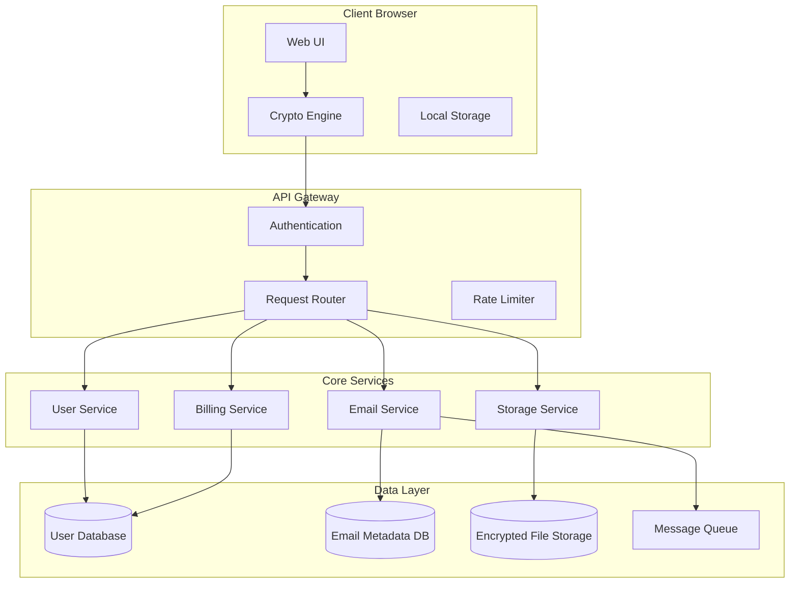

# Design Document - Encrypted Email Service

## Overview

The Encrypted Email Service is a web-based platform that provides secure, privacy-focused email communication using client-side encryption. The system architecture ensures that all sensitive data is encrypted before leaving the user's browser, with the server infrastructure handling only encrypted data routing and storage management.

## Architecture

### High-Level Architecture



### Security Architecture

The system implements a zero-knowledge architecture where:
- All encryption/decryption happens client-side using Web Crypto API
- Server never has access to plaintext data or user private keys
- End-to-end encryption for all email communications
- Client-side key derivation from user passwords using PBKDF2

## Components and Interfaces

### Frontend Components

#### 1. Crypto Engine
- **Purpose**: Handle all cryptographic operations in the browser
- **Key Functions**:
  - Generate RSA key pairs for asymmetric encryption
  - Derive AES keys from user passwords using PBKDF2
  - Encrypt/decrypt emails and files using AES-256-GCM
  - Digital signature generation and verification
- **Technologies**: Web Crypto API, SubtleCrypto

#### 2. Email Client Interface
- **Purpose**: Provide sleek, modern email management UI with fluid animations
- **Key Functions**:
  - Compose, send, receive, and organize emails with smooth transitions
  - Real-time email notifications via WebSocket with animated toasts
  - Attachment handling with client-side encryption and drag-drop animations
  - Search functionality on decrypted content with live filtering animations
- **Design Principles**:
  - Micro-interactions for all user actions (hover, click, focus states)
  - Smooth page transitions using CSS transforms and opacity
  - Loading states with skeleton screens and progress indicators
  - Gesture-based interactions for mobile (swipe to delete, pull to refresh)
- **Technologies**: React/Vue.js, Framer Motion, CSS-in-JS, WebSocket, IndexedDB

#### 3. Storage Manager
- **Purpose**: Handle encrypted file storage with elegant visual feedback
- **Key Functions**:
  - Upload/download encrypted files with animated progress bars
  - Storage quota management with visual usage indicators
  - File organization with smooth drag-and-drop animations
  - Metadata management with expandable file details
- **Animation Features**:
  - File upload progress with circular progress indicators
  - Drag-and-drop zones with hover state animations
  - File grid/list view transitions with staggered animations
  - Storage usage visualization with animated charts
- **Technologies**: File API, Drag & Drop API, CSS Grid, Intersection Observer

### Backend Services

#### 1. User Service
- **Purpose**: Manage user accounts and authentication
- **Endpoints**:
  - `POST /api/auth/register` - Create new user account
  - `POST /api/auth/login` - Authenticate user
  - `GET /api/user/profile` - Get user profile
  - `PUT /api/user/profile` - Update user settings
- **Security**: JWT tokens, bcrypt password hashing

#### 2. Email Service
- **Purpose**: Route encrypted emails between users
- **Endpoints**:
  - `POST /api/email/send` - Send encrypted email
  - `GET /api/email/inbox` - Get inbox metadata
  - `GET /api/email/{id}` - Get encrypted email content
  - `DELETE /api/email/{id}` - Delete email
- **Features**: Message queuing, delivery confirmation, spam filtering

#### 3. Storage Service
- **Purpose**: Manage encrypted file storage
- **Endpoints**:
  - `POST /api/storage/upload` - Upload encrypted file
  - `GET /api/storage/files` - List user files
  - `GET /api/storage/download/{id}` - Download encrypted file
  - `DELETE /api/storage/{id}` - Delete file
- **Features**: Chunked uploads, deduplication, quota enforcement

#### 4. Billing Service
- **Purpose**: Handle subscription management and payments
- **Endpoints**:
  - `GET /api/billing/plans` - Get available storage plans
  - `POST /api/billing/subscribe` - Upgrade storage plan
  - `GET /api/billing/usage` - Get current usage statistics
- **Integration**: Stripe for payment processing

## Data Models

### User Model
```typescript
interface User {
  id: string;
  email: string;
  passwordHash: string;
  publicKey: string; // RSA public key for receiving emails
  encryptedPrivateKey: string; // Encrypted with password-derived key
  storageQuota: number; // in bytes
  storageUsed: number; // in bytes
  subscriptionPlan: 'free' | 'basic' | 'standard' | 'premium' | 'pro';
  createdAt: Date;
  lastLoginAt: Date;
}
```

### Email Metadata Model
```typescript
interface EmailMetadata {
  id: string;
  senderId: string;
  recipientIds: string[];
  subject: string; // encrypted
  timestamp: Date;
  size: number;
  attachmentCount: number;
  isRead: boolean;
  folderId?: string;
}
```

### Encrypted Email Model
```typescript
interface EncryptedEmail {
  id: string;
  encryptedContent: string; // AES encrypted email body
  encryptedSubject: string; // AES encrypted subject
  encryptedAttachments: EncryptedAttachment[];
  senderSignature: string; // Digital signature
  recipientKeys: { [userId: string]: string }; // AES key encrypted with recipient's public key
}
```

### File Model
```typescript
interface EncryptedFile {
  id: string;
  userId: string;
  filename: string; // encrypted
  encryptedContent: Blob;
  size: number;
  mimeType: string;
  uploadedAt: Date;
  encryptionKey: string; // encrypted with user's key
}
```

## Error Handling

### Client-Side Error Handling
- **Crypto Errors**: Graceful handling of encryption/decryption failures
- **Network Errors**: Retry logic with exponential backoff
- **Storage Errors**: Quota exceeded notifications and cleanup suggestions
- **Browser Compatibility**: Feature detection and fallbacks

### Server-Side Error Handling
- **Authentication Errors**: Clear error messages without information leakage
- **Rate Limiting**: 429 responses with retry-after headers
- **Storage Errors**: Detailed quota and capacity error responses
- **Service Errors**: Structured error responses with error codes

### Error Response Format
```typescript
interface ErrorResponse {
  error: {
    code: string;
    message: string;
    details?: any;
    timestamp: string;
  };
}
```

## Testing Strategy

### Frontend Testing
- **Unit Tests**: Crypto functions, utility functions, component logic
- **Integration Tests**: Email flow, file upload/download, authentication
- **E2E Tests**: Complete user workflows using Playwright
- **Security Tests**: Crypto implementation validation, XSS prevention

### Backend Testing
- **Unit Tests**: Service layer logic, data validation, crypto utilities
- **Integration Tests**: API endpoints, database operations, external services
- **Load Tests**: Performance under concurrent users, storage operations
- **Security Tests**: Authentication, authorization, input validation

### Security Testing
- **Penetration Testing**: Third-party security assessment
- **Crypto Audit**: Independent review of encryption implementation
- **Compliance Testing**: GDPR, privacy regulation compliance
- **Vulnerability Scanning**: Automated security scanning

## Performance Considerations

### Client-Side Optimization
- **Lazy Loading**: Load crypto libraries and large components on demand
- **Web Workers**: Perform encryption/decryption in background threads
- **Caching**: Cache encrypted emails and files in IndexedDB
- **Compression**: Compress data before encryption
- **Animation Performance**: 
  - Use CSS transforms and opacity for 60fps animations
  - Implement will-change property for optimized rendering
  - Debounce scroll and resize events for smooth interactions
  - Use requestAnimationFrame for custom animations

### UI/UX Performance
- **Smooth Interactions**: Sub-100ms response times for all UI interactions
- **Progressive Loading**: Skeleton screens during data fetching
- **Optimistic Updates**: Immediate UI feedback before server confirmation
- **Reduced Motion**: Respect user's prefers-reduced-motion settings
- **Hardware Acceleration**: GPU-accelerated animations using transform3d

### Server-Side Optimization
- **CDN**: Serve static assets via CDN
- **Caching**: Redis for session data and frequently accessed metadata
- **Database Optimization**: Proper indexing, connection pooling
- **Horizontal Scaling**: Microservices architecture for independent scaling

## Privacy and Compliance

### Data Protection
- **Zero-Knowledge**: Server cannot access user data or communications
- **Data Minimization**: Collect only necessary metadata
- **Right to Deletion**: Complete data removal on account deletion
- **Data Portability**: Export functionality for user data

### Compliance Features
- **GDPR Compliance**: Privacy by design, consent management
- **Audit Logging**: Security event logging without sensitive data
- **Data Retention**: Configurable retention policies
- **Transparency**: Clear privacy policy and data handling practices